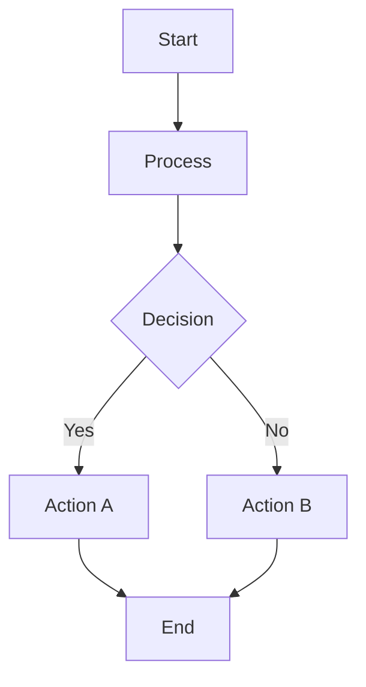
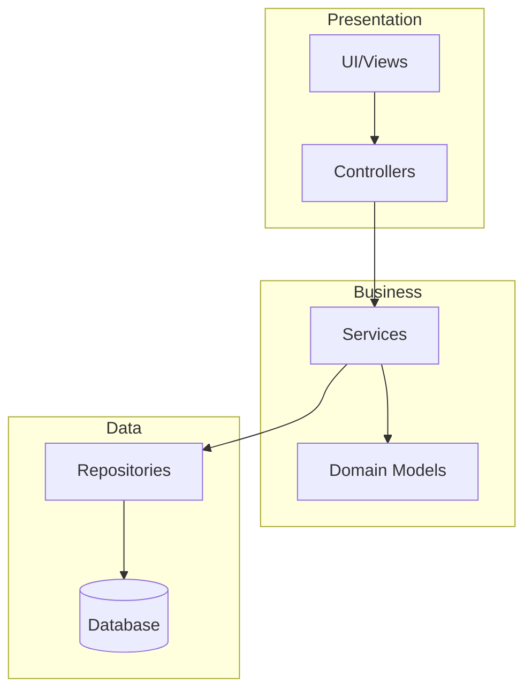
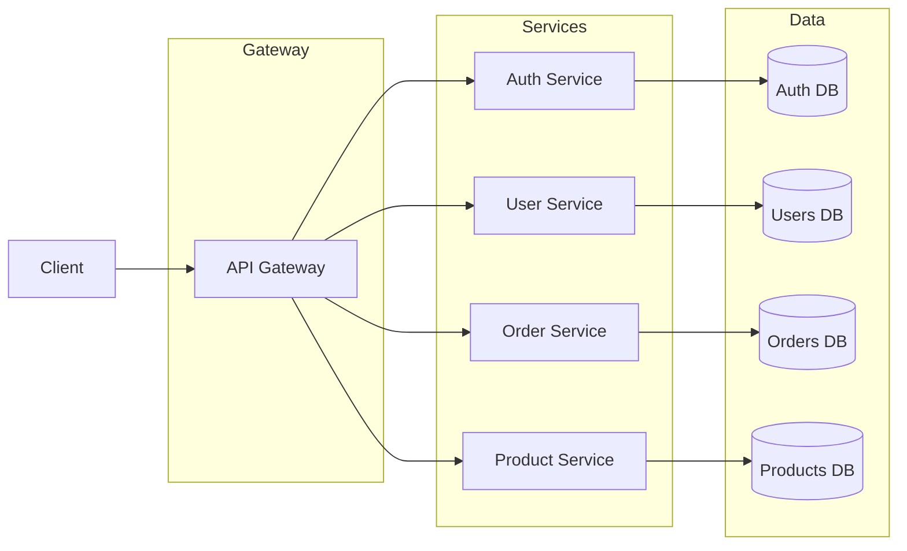
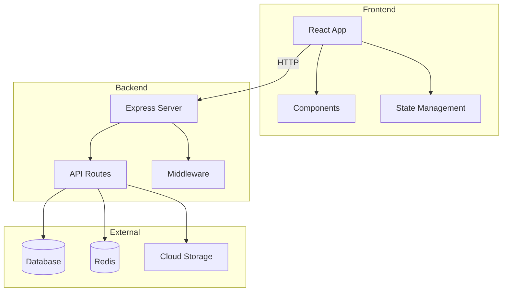
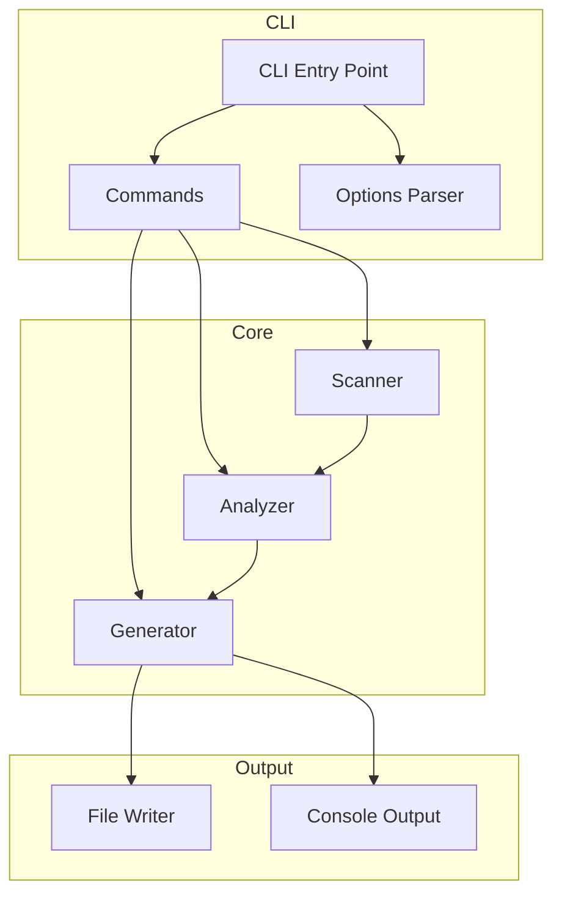
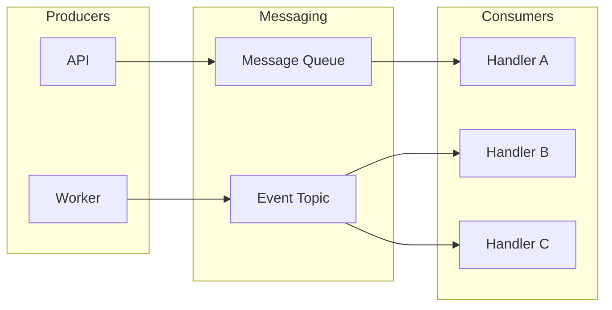
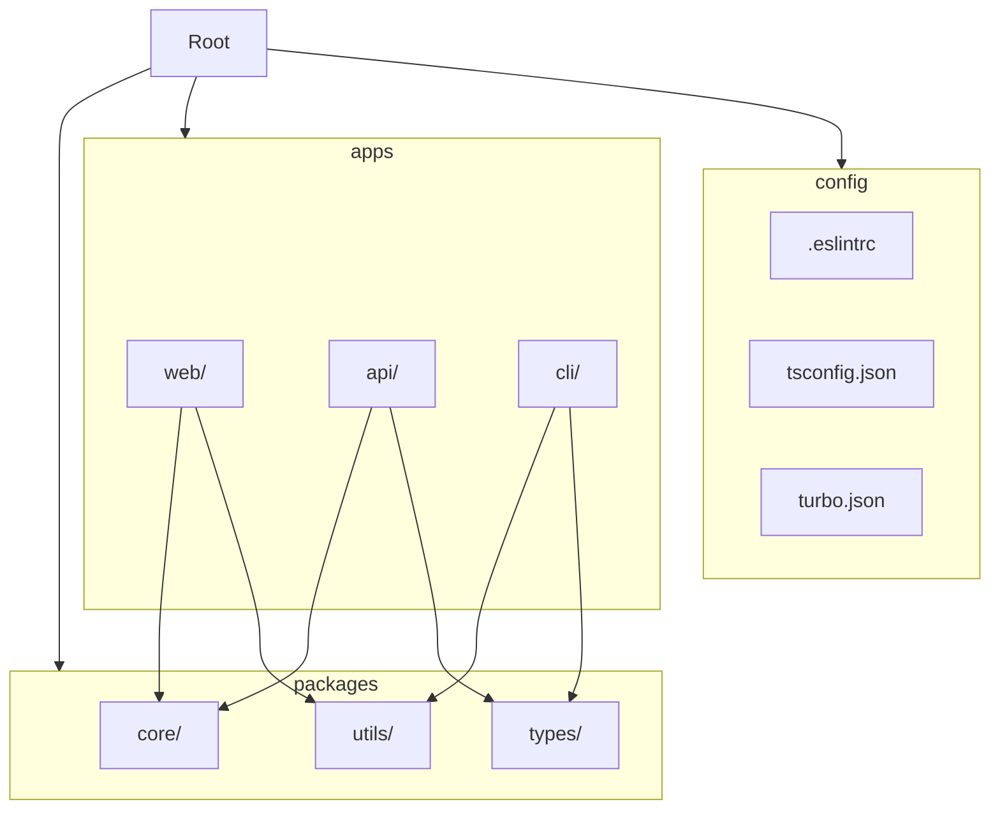
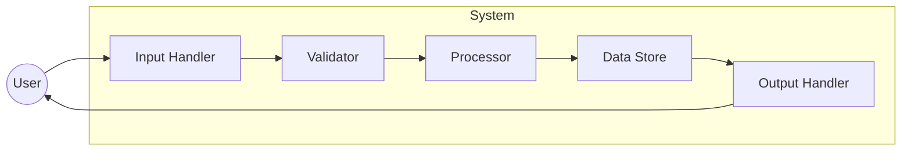
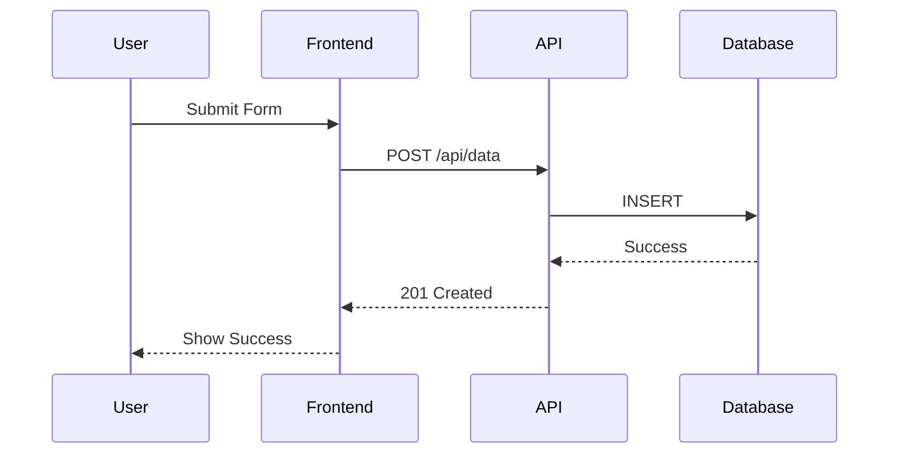
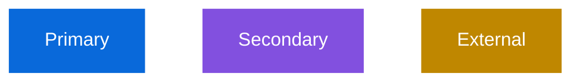

# Mermaid Diagram Patterns

Templates for common architecture diagrams. Use these as starting points when generating component diagrams.

## Basic Flowchart

## Layered Architecture (MVC, Clean Architecture)

## Microservices Architecture

## Frontend/Backend Split

## CLI Tool Structure

## Event-Driven Architecture

## Monorepo Structure

## Data Flow Diagram

## Sequence Diagram (for flows)

## Tips for Good Diagrams

### Do's
- Use meaningful node IDs (`AuthService` not `A1`)
- Group related components with subgraphs
- Keep labels short but descriptive
- Show data flow direction
- Limit to 15-20 nodes maximum

### Don'ts
- Don't include every file (show components)
- Don't use generic labels ("Box 1")
- Don't make it too complex
- Don't mix diagram types

### Styling

### Node Shapes

- `[text]` - Rectangle (default)
- `(text)` - Rounded rectangle
- `{text}` - Diamond (decision)
- `([text])` - Stadium
- `[(text)]` - Cylinder (database)
- `((text))` - Circle
