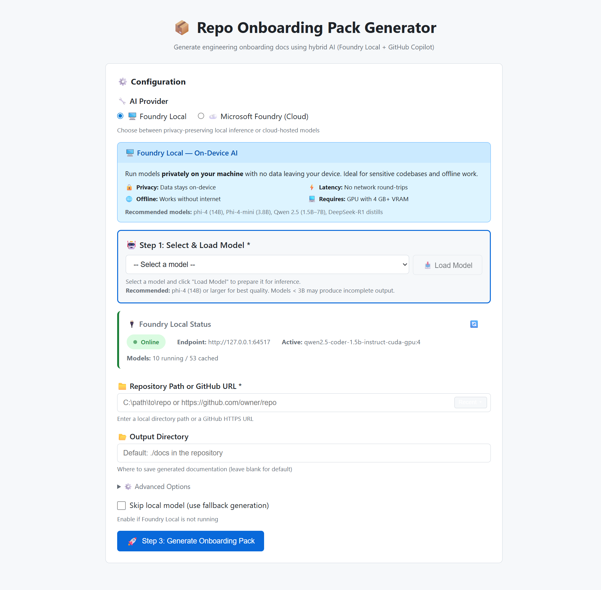
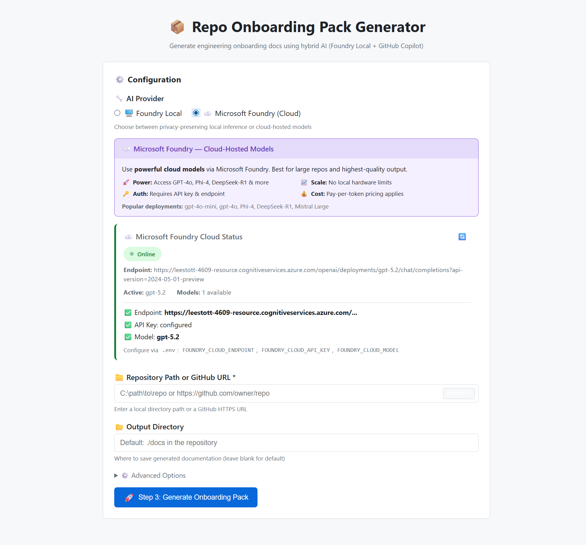
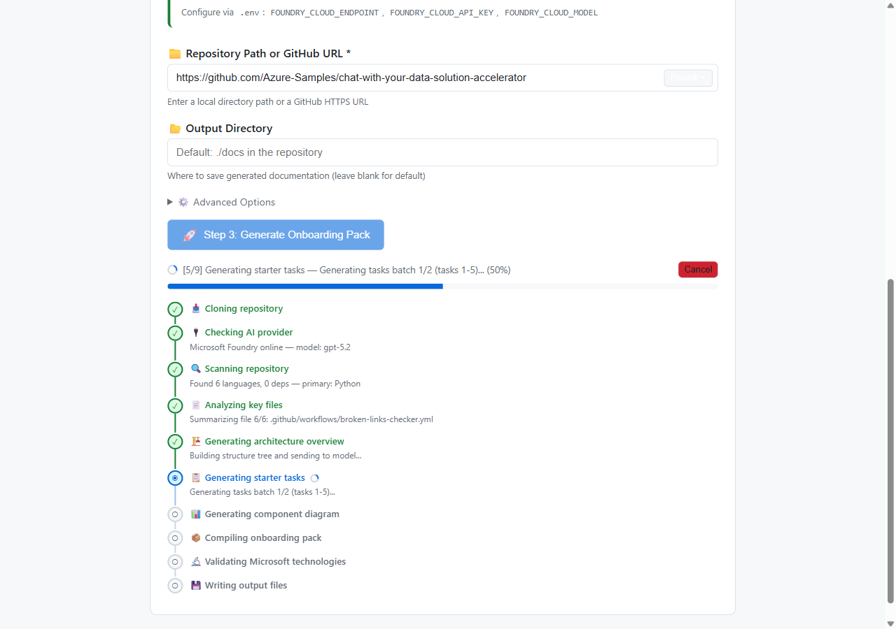
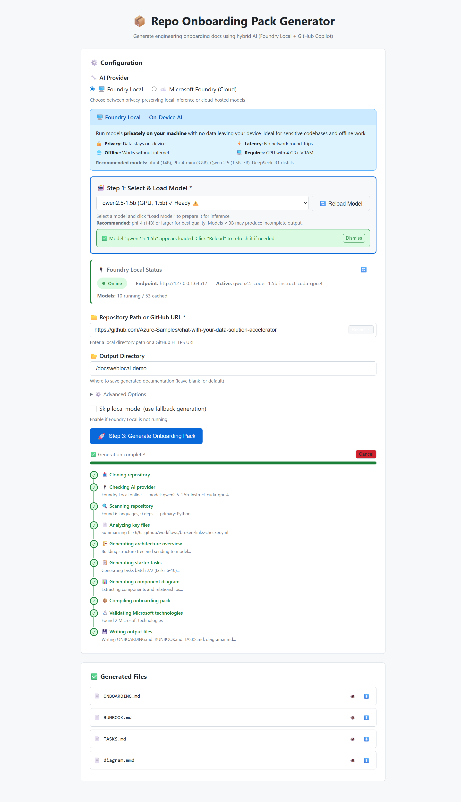
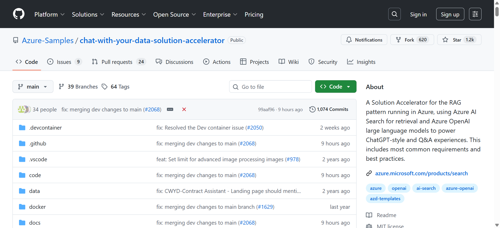
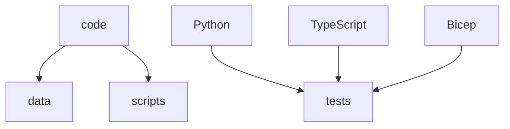
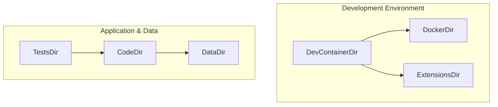
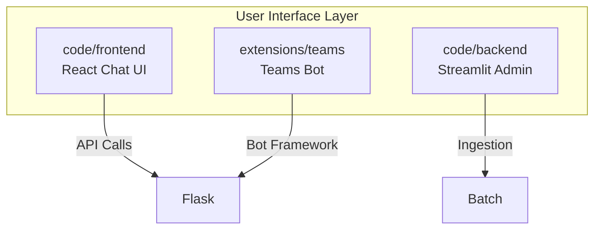

# Repo Onboarding Pack Generator

[](https://opensource.org/licenses/MIT)
[](https://nodejs.org/)
[](https://www.typescriptlang.org/)
[](https://github.com/microsoft/foundry)
[](https://ai.azure.com/)
[](https://github.com/features/copilot)
[](https://github.com/github/copilot-sdk)
[](https://github.com/MicrosoftDocs/mcp)

<p align="center">
  
</p>

<p align="center">
  <strong>Generate comprehensive onboarding documentation for any repository using hybrid AI</strong>
</p>

<p align="center">
  <a href="#quick-start">Quick Start</a> •
  <a href="#features">Features</a> •
  <a href="#web-ui">Web UI</a> •
  <a href="#cli-usage">CLI</a> •
  <a href="#agent-skill">Agent Skill</a> •
  <a href="#using-with-vs-code-copilot-chat">Copilot Chat</a> •
  <a href="#contributing">Contributing</a>
</p>

---

## Features

Generate comprehensive onboarding documentation for any repository using a hybrid AI approach:
- **Foundry Local** for privacy-sensitive local inference (no data leaves your machine)
- **Microsoft Foundry** for cloud-hosted models with higher quality and faster inference
- **GitHub Copilot SDK** (`@github/copilot-sdk`) for agentic workflows via the Copilot CLI
- **Agent Skills** for reusable, teachable AI behaviors

## Quick Start

```bash
# One-command setup (checks Node.js, Git, installs deps, verifies TypeScript, configures .env)
npm run setup

# Or on Windows directly:  .\setup.ps1
# Or on Linux/macOS:       chmod +x setup.sh && ./setup.sh
```

Once setup completes, pick a mode:

```bash
# Run with Foundry Local (privacy-preserving)
npm run onboard -- https://github.com/Azure-Samples/chat-with-your-data-solution-accelerator

# Run with Microsoft Foundry (cloud   higher quality)
npm run onboard -- https://github.com/Azure-Samples/chat-with-your-data-solution-accelerator \
  --cloud-endpoint https://your-resource.cognitiveservices.azure.com/openai/deployments/ \
  --cloud-api-key YOUR_API_KEY \
  --cloud-model gpt-4o-mini

# Run with GitHub Copilot SDK (requires Copilot CLI)
npm run onboard -- https://github.com/Azure-Samples/chat-with-your-data-solution-accelerator \
  --copilot-sdk --copilot-model claude-sonnet-4
```

## What It Generates

| File | Purpose |
|------|---------|
| `ONBOARDING.md` | Architecture overview, key flows, dependency map, **instructor section** with learning outcomes and session plan |
| `RUNBOOK.md` | Build, run, test commands + troubleshooting |
| `TASKS.md` | 10 starter tasks with acceptance criteria, hints, and **learning objectives** per task |
| `AGENTS.md` | Agent skills, MCP servers, workflows (incl. code-review), and **GitHub Copilot usage guide** |
| `VALIDATION.md` | Microsoft Learn validation queries & checklist (when MS tech detected) |
| `diagram.mmd` | Mermaid component diagram |

## Architecture

```
┌──────────────────────────────────────────────────────────────────┐
│  Interfaces                                                      │
│  ┌──────────────────────┐    ┌──────────────────────┐           │
│  │    CLI (index.ts)     │    │  Web UI (server.ts)  │           │
│  │  Commander parsing    │    │  HTTP + SSE progress │           │
│  └──────────┬───────────┘    └──────────┬───────────┘           │
│             └────────────┬──────────────┘                        │
│                          ▼                                       │
│  ┌──────────────────────────────────────────────────────┐       │
│  │              Orchestrator (orchestrator.ts)           │       │
│  │  9-step pipeline · tool-calling pattern · progress CB│       │
│  ├───────┬──────────────┬───────────────┬───────────────┤       │
│  │       ▼              ▼               ▼               │       │
│  │ RepoScanner    LocalModelClient  CopilotSdkClient    │       │
│  │ (repoScanner   (localModelClient (copilotSdkClient   │       │
│  │   .ts)           .ts)              .ts)               │       │
│  │ · Languages    · Foundry Local   · @github/copilot   │       │
│  │ · Build sys    · Azure Foundry     -sdk (v0.1.23)    │       │
│  │ · Deps         · OpenAI-compat   · BYOK providers    │       │
│  │ · Structure    · File summary    · Session mgmt      │       │
│  └───────┴──────────────┴───────────────┴───────────────┘       │
│                                                                  │
│  Shared: types.ts (interfaces) · validation.ts (input safety)   │
└──────────────────────────────────────────────────────────────────┘
                          │
          ┌───────────────┼───────────────┐
          ▼               ▼               ▼
   Foundry Local    Microsoft Foundry   Copilot CLI
   localhost:PORT   *.cognitiveservices  JSON-RPC
   (on-device GPU)  .azure.com (cloud)  (GitHub auth)
```

The project has **8 source files** in `src/`:

| File | Role |
|------|------|
| `index.ts` | CLI entry point   Commander argument parsing |
| `server.ts` | Web UI   HTTP server with SSE progress streaming |
| `orchestrator.ts` | 9-step generation pipeline with tool-calling pattern |
| `localModelClient.ts` | LLM client for Foundry Local and Microsoft Foundry (OpenAI-compatible) |
| `copilotSdkClient.ts` | LLM client for GitHub Copilot SDK (`@github/copilot-sdk`) |
| `repoScanner.ts` | Repository analysis   languages, deps, build systems, structure |
| `types.ts` | Shared TypeScript interfaces |
| `validation.ts` | Input validation and security checks |

## Hybrid AI Approach

This tool supports three inference backends   use whichever fits your needs:

### Foundry Local (Privacy-First)

All processing stays on your machine:

- **File summarization**: Analyze source code content locally
- **Config pattern extraction**: Identify configuration without exposing secrets
- **Dependency inventory**: Generate descriptions for packages
- **Architecture inference**: Determine patterns from structure

> Install: `winget install Microsoft.FoundryLocal`   see [Starting Foundry Local](#starting-foundry-local)

### Microsoft Foundry (Cloud)

Higher-quality output using cloud-hosted models:

- **Larger models**: Access GPT-4o, Phi-4, DeepSeek-R1, and more
- **Faster inference**: No GPU required on your machine
- **Same workflow**: Identical 9-step pipeline, just a different backend
- **OpenAI-compatible**: Works with any Microsoft Foundry deployment

> Get started at [ai.azure.com](https://ai.azure.com/)   see [Cloud Usage](#cloud-usage)

### GitHub Copilot SDK

Agentic workflows using the official [`@github/copilot-sdk`](https://github.com/github/copilot-sdk):

- **Session-based**: Stateful conversations with plan/execute capabilities
- **BYOK support**: Connect to Foundry Local, Azure OpenAI, or other OpenAI-compatible endpoints
- **Tool-calling**: Define custom tools the agent can invoke during generation
- **Multiple models**: Access GPT-4o, Claude Sonnet, and more via GitHub Copilot

> Requires: `npm install -g @github/copilot`   see [Copilot SDK Usage](#copilot-sdk-usage)

### What the Copilot Agent Does

Orchestration and coordination (same for both backends):

- **Workflow planning**: Sequence the analysis steps
- **File operations**: Write generated documentation
- **Command execution**: Run build/test verification
- **Cross-file analysis**: Understand relationships

## GitHub Copilot SDK Integration

This project uses the official [`@github/copilot-sdk`](https://github.com/github/copilot-sdk) (v0.1.23) for agentic AI workflows. The SDK communicates with the Copilot CLI via JSON-RPC, providing session management, tool-calling, and BYOK (Bring Your Own Key) support.

### Copilot Tool-Calling Pattern

The orchestrator (`src/orchestrator.ts`) implements the Copilot Extensions **tool-calling pattern**   each capability is defined as a discrete tool with a name, description, typed parameters, and an async handler:

```typescript
// OrchestratorTool interface mirrors the Copilot Extensions tool schema
interface OrchestratorTool {
  name: string;
  description: string;
  parameters: Record<string, ToolParameter>;
  handler: (params: Record<string, unknown>) => Promise<unknown>;
}
```

Seven tools are registered for the orchestration session:

| Tool | Purpose |
|------|---------|
| `scanRepo` | Scan repository structure, languages, and dependencies |
| `localSummarize` | Summarize a file using the local/cloud model |
| `localAnalyzeArchitecture` | Generate architecture overview from key files |
| `localGenerateTasks` | Create starter tasks for new contributors |
| `localGenerateDiagram` | Generate a Mermaid component diagram |
| `writeDoc` | Write a documentation file to the output directory |
| `runCommand` | Execute a shell command in the repository context |

This mirrors how Copilot Extensions expose capabilities to the LLM   each tool is self-describing and independently invocable, enabling the agent to compose multi-step workflows.

### Agent Skill Structure

The project ships as a set of **GitHub Copilot Agent Skills** in `.github/skills/`. Each skill follows the [Copilot custom instructions format](https://docs.github.com/en/copilot/customizing-copilot/adding-repository-custom-instructions-for-github-copilot) with YAML frontmatter and trigger phrases:

```yaml
---
name: repo-onboarding-pack
description: Generate comprehensive engineering onboarding documentation...
compatibility: Works with any Git repository...
---
```

Skills are activated by natural-language trigger phrases (e.g., *"Create onboarding pack for this repo"*) and include quality gates, prompt templates, and validation checklists   so Copilot can autonomously generate and verify output.

### Workflow Session

The 9-step generation pipeline runs as a **Copilot SDK-style session**   a stateful sequence of tool invocations with progress tracking, error recovery, and structured output:

1. Check inference endpoint → 2. Scan repo → 3. Analyze files → 4. Architecture → 5. Tasks → 6. Diagram → 7. Compile → 8. Microsoft Learn validation → 9. Write files

Each step reports progress via a callback (`ProgressCallback`), enabling real-time UI updates in both the CLI and web interface.

### Copilot Instructions

The project includes `.github/copilot-instructions.md` which configures GitHub Copilot's behavior when working in this repository   linking to skills, defining workflows, and setting up the Microsoft Learn MCP integration.

## CLI Usage

### Foundry Local (Default)

```bash
# Basic usage   any GitHub URL or local path
npx onboard https://github.com/Azure-Samples/chat-with-your-data-solution-accelerator

# With options
npx onboard https://github.com/Azure-Samples/chat-with-your-data-solution-accelerator \
  --output ./onboarding-docs \
  --model phi-4 \
  --verbose
```

### Cloud Usage

```bash
# Using Microsoft Foundry cloud models
npx onboard https://github.com/Azure-Samples/chat-with-your-data-solution-accelerator \
  --cloud-endpoint https://your-project.services.ai.azure.com \
  --cloud-api-key YOUR_API_KEY \
  --cloud-model gpt-4o-mini \
  --verbose

# Using environment variable for API key
export FOUNDRY_CLOUD_API_KEY=your-key-here
npx onboard https://github.com/Azure-Samples/chat-with-your-data-solution-accelerator \
  --cloud-endpoint https://your-project.services.ai.azure.com \
  --cloud-model gpt-4o
```

### Copilot SDK Usage

```bash
# Use GitHub Copilot SDK (requires Copilot CLI: npm install -g @github/copilot)
npx onboard https://github.com/Azure-Samples/chat-with-your-data-solution-accelerator --copilot-sdk

# Specify a Copilot model
npx onboard https://github.com/Azure-Samples/chat-with-your-data-solution-accelerator \
  --copilot-sdk --copilot-model gpt-4o
```

### Other Commands

```bash
# Check Foundry Local status
npx onboard --check-status

# Skip AI entirely (use fallback generation)
npx onboard https://github.com/Azure-Samples/chat-with-your-data-solution-accelerator --skip-local
```

## Web UI

Launch the graphical interface for a browser-based experience:

```bash
# Start the web server
npm run web

# Or with custom port
PORT=8080 npm run web
```

Then open [http://localhost:3000](http://localhost:3000) in your browser.

### Keyboard Shortcuts

| Key | Action |
|-----|--------|
| `R` | Refresh Foundry status |
| `Esc` | Close preview modal |
| `Ctrl+C` | Copy file content (in modal) |

### Screenshots

**Home   Foundry Local provider with model selection and live status:**

<p align="center">
  
</p>

**Cloud provider   Microsoft Foundry with endpoint, model, and API key status:**

<p align="center">
  
</p>

**Form filled   ready to generate onboarding docs for a GitHub repository:**

<p align="center">
  
</p>

**Step-by-step progress   real-time tracking of the 9-step generation pipeline:**

<p align="center">
  
</p>

<p align="center">
  
</p>

**Generation complete   all steps done with generated files listed for preview/download:**

<p align="center">
  
</p>

**Web UI Features:**
- 🔌 Real-time Foundry Local connection status with model details
- ☁️ Microsoft Foundry cloud support with provider toggle
- 📂 Support for local paths and GitHub URLs
- 🕒 Recent repositories dropdown (stored locally)
- 📊 Step-by-step progress tracking with per-step details and cancel support
- 👁️ Preview generated files with syntax highlighting
- 📋 Copy to clipboard and download buttons
- ⌨️ Keyboard shortcuts (Esc to close, R to refresh)
- ♿ Full accessibility support (ARIA labels, focus management)
- 🌙 Automatic dark mode support

### Options

| Flag | Description | Default |
|------|-------------|---------|
| `-o, --output <dir>` | Output directory | `./docs` in repo |
| `-e, --endpoint <url>` | Foundry Local endpoint | Auto-detected |
| `-m, --model <name>` | Local model to use | `phi-4` |
| `-v, --verbose` | Show detailed progress | `false` |
| `--skip-local` | Skip AI calls (use fallback) | `false` |
| `--check-status` | Check Foundry status and exit | - |
| `--cloud-endpoint <url>` | Microsoft Foundry endpoint URL | - |
| `--cloud-api-key <key>` | Cloud API key | `$FOUNDRY_CLOUD_API_KEY` |
| `--cloud-model <name>` | Cloud model deployment name | `gpt-4o-mini` |
| `--copilot-sdk` | Use GitHub Copilot SDK for inference | `false` |
| `--copilot-model <name>` | Copilot SDK model name | `claude-sonnet-4` |

## Demo & Benchmarking

All demo output lives in [`docs/demos/`](docs/demos/) and was generated from a single repository: [Azure-Samples/chat-with-your-data-solution-accelerator](https://github.com/Azure-Samples/chat-with-your-data-solution-accelerator)   a popular RAG pattern accelerator with 1.2k+ stars, Python backend, TypeScript frontend, Bicep infrastructure, and 34+ contributors.

<p align="center">
  
</p>

We ran the generator **four times** against this repository   once per provider/interface combination   to compare output quality, size, and content.

### Generated Demo Folders

| Folder | Interface | Provider | Model | Command |
|--------|-----------|----------|-------|---------|
| [`docscli-local/`](docs/demos/docscli-local/) | CLI | Foundry Local | qwen2.5-coder-1.5b | `npx tsx src/index.ts <url> --output docs/demos/docscli-local` |
| [`docsweblocal/`](docs/demos/docsweblocal/) | Web UI | Foundry Local | qwen2.5-coder-1.5b | Web UI → Foundry Local provider |
| [`docswebcloud/`](docs/demos/docswebcloud/) | Web UI | Microsoft Foundry | gpt-5.2 | Web UI → Cloud provider |
| [`docswebgithub/`](docs/demos/docswebgithub/) | Web UI | GitHub Copilot SDK | Copilot model | Web UI → Copilot SDK provider |

### Benchmark: Output Size by Provider

File sizes in **bytes**   larger LLM-generated files generally indicate richer, more detailed content.

| File | CLI + Local | Web + Local | Web + Cloud (gpt-5.2) | Web + Copilot SDK |
|------|------------:|------------:|----------------------:|------------------:|
| ONBOARDING.md | 3,937 | 3,937 | **6,020** | **6,874** |
| RUNBOOK.md | 2,358 | 2,358 | 2,358 | 2,358 |
| TASKS.md | 8,158 | 8,158 | **10,078** | **9,714** |
| AGENTS.md | 2,323 | 2,323 | 2,323 | 2,323 |
| diagram.mmd | 285 | 285 | 733 | **1,393** |
| VALIDATION.md | 2,549 | 2,549 | 2,549 | 2,549 |
| **Total (bytes)** | **19,610** | **19,610** | **24,061** | **25,211** |

#### What each file measures

| File | What it tells you |
|------|-------------------|
| **ONBOARDING.md** | Architecture depth   how well the LLM understands the repo's structure, components, and key flows |
| **RUNBOOK.md** | Build/run/test commands   deterministic (not LLM-generated), so identical across providers |
| **TASKS.md** | Starter-task quality   repo-specific acceptance criteria, hints, and learning objectives |
| **AGENTS.md** | Agent config   deterministic skills, MCP servers, and workflows extracted from repo metadata |
| **diagram.mmd** | Diagram complexity   number of Mermaid nodes, subgraphs, and labeled edges |
| **VALIDATION.md** | Microsoft Learn queries   deterministic, generated from detected Microsoft technologies |

> **Key insight:** AGENTS.md, RUNBOOK.md, and VALIDATION.md are identical across all providers   they are generated deterministically from repo metadata, not by the LLM. The LLM-generated files (ONBOARDING.md, TASKS.md, diagram.mmd) show the real quality differences. Cloud and Copilot SDK produce **23–29% more content** than the local 1.5B model.

### Quality Review

#### Architecture Recognition (ONBOARDING.md)

Each provider identified the same repo differently:

| Dimension | Foundry Local (1.5B) | Microsoft Foundry (gpt-5.2) | GitHub Copilot SDK |
|-----------|---------------------|---------------------------|-------------------|
| **Pattern detected** | "Monolithic" | "Monorepo" | "Serverless" |
| **Component count** | 5 (generic names) | 10 (directory-mapped table) | 14 (directory-mapped table with purpose) |
| **Key interactions** | 3 bullet points, generic | 3 numbered items with exact file paths | Detailed multi-tier description with orchestration strategies |
| **Architecture depth** | High-level only | Component table with subgraphs | Full multi-tier breakdown: UI layer, processing layer, infra, data |

**Verbatim   Foundry Local** classified the architecture as:
> *"The project is structured as a monolithic application, where all components are tightly coupled and reside in a single codebase."*

**Verbatim   Microsoft Foundry** identified it as a monorepo:
> *"This project is a single repository that contains multiple deployable parts: a Python backend (including an Azure Functions batch/ingestion workload and an admin UI), a separate TypeScript/Vite frontend web app, and an optional Microsoft Teams extension."*

**Verbatim   GitHub Copilot SDK** went deepest:
> *"This is an Azure-native RAG (Retrieval Augmented Generation) solution accelerator using a serverless architecture. The system enables conversational search over user documents by combining Azure OpenAI for LLM capabilities with Azure AI Search for vector retrieval."*

#### Component Diagram Quality (diagram.mmd)

| Provider | Nodes | Subgraphs | Edge Labels | Size |
|----------|------:|----------:|:-----------:|-----:|
| Foundry Local | 10 | 0 | No | 285 B |
| Microsoft Foundry | 12 | 3 | No | 733 B |
| GitHub Copilot SDK | 14 | 5 | Yes | 1,393 B |

**Verbatim   Foundry Local** produced a flat graph with raw directory/language names:


**Verbatim   Microsoft Foundry** added meaningful subgraphs:


**Verbatim   GitHub Copilot SDK** produced the richest diagram with labeled edges and component-level detail:


#### Starter Task Quality (TASKS.md)

Every provider generated 10 tasks with learning objectives. The depth difference is dramatic:

**Verbatim   Foundry Local** tasks are generic templates:
> 🟡 **Task 1: Review Code Structure** \
> *Learning: Understand file organization and directory structure* \
> Criteria: "Know the location of the `api`, `database`, and `orchestrator` directories"

Note: The local model also produced **parsing artifacts**   field labels bled into content (e.g., `Skills: File navigation` appearing inside related-files lists).

**Verbatim   Microsoft Foundry** tasks reference exact files and real workflows:
> 🟢 **Task 1: Trace the Chat Request Path (Frontend → Backend)** \
> *Learning: Code navigation in a monorepo; understanding API boundaries between TypeScript frontend and Python backend* \
> Criteria: "Identifies the exact frontend function(s) that issue the chat request" \
> Hints: "Search for the chat endpoint path in `code/frontend/src/api/*`"

**Verbatim   GitHub Copilot SDK** tasks tie to real engineering concepts:
> 🟢 **Task 1: Explore the RAG Architecture Documentation** \
> *Learning: Understanding RAG (Retrieval Augmented Generation) patterns and Azure service integration* \
> Criteria: "Can explain the role of Azure OpenAI and Azure AI Search" \
> Related files: `README.md`, `docs/integrated_vectorization.md`, `docs/conversation_flow_options.md`

#### Task Difficulty Distribution

| Difficulty | Foundry Local | Microsoft Foundry | GitHub Copilot SDK |
|------------|:------------:|:----------------:|:------------------:|
| 🟢 Easy | 5 | 3 | 3 |
| 🟡 Medium | 3 | 4 | 4 |
| 🔴 Hard | 2 | 3 | 3 |

Cloud and Copilot providers produced a more balanced difficulty curve with harder tasks that involve real cross-component work (e.g., "Refactor Backend App Initialization for Clearer Dependency Injection", "Extend Infrastructure with New Bicep Module").

#### Summary Scorecard

| Dimension | Foundry Local (1.5B) | Microsoft Foundry (gpt-5.2) | GitHub Copilot SDK |
|-----------|:-------------------:|:-------------------------:|:-----------------:|
| Architecture accuracy | ⭐⭐ | ⭐⭐⭐⭐ | ⭐⭐⭐⭐⭐ |
| Task specificity | ⭐⭐ | ⭐⭐⭐⭐⭐ | ⭐⭐⭐⭐⭐ |
| Learning objectives | ⭐⭐⭐ | ⭐⭐⭐⭐ | ⭐⭐⭐⭐⭐ |
| Diagram quality | ⭐⭐ | ⭐⭐⭐⭐ | ⭐⭐⭐⭐⭐ |
| Parsing cleanliness | ⭐⭐ | ⭐⭐⭐⭐⭐ | ⭐⭐⭐⭐⭐ |
| Privacy | ✅ On-device | ❌ Cloud | ❌ Cloud |
| Cost | Free | Pay-per-token | Copilot subscription |
| GPU required | Yes (local) | No | No |

### Which Provider Should You Use?

| Use Case | Recommended Provider |
|----------|---------------------|
| Proprietary code, air-gapped environments | **Foundry Local**   no data leaves your machine |
| Best output quality, team documentation | **Microsoft Foundry** or **GitHub Copilot SDK** |
| Students with Copilot access, no API keys | **GitHub Copilot SDK** |
| Quick drafts to refine manually | **Foundry Local** (fastest setup, zero cost) |
| Classroom with mixed setups | Start with **Foundry Local**, upgrade output with cloud if allowed |

### Sample CLI Output

```
🚀 Repo Onboarding Pack Generator v1.0.0

📥 Cloning: https://github.com/Azure-Samples/chat-with-your-data-solution-accelerator
   Using cached clone...

[1/9] Checking LLM provider...
✓ Foundry Local available at http://127.0.0.1:65503
  Active model: qwen2.5-coder-1.5b-instruct-cuda-gpu:4

[2/9] Scanning repository...
✓ Found 6 languages   Primary: Python

[3/9] Analyzing key files...
  Summarized: README.md, package.json, Makefile, pyproject.toml

[4/9] Generating architecture overview...
[5/9] Generating starter tasks...
[6/9] Generating component diagram...
[7/9] Compiling onboarding pack...
[8/9] Validating Microsoft technologies...
  Found: TypeScript, Bicep
[9/9] Writing output files...

✓ Onboarding pack generated successfully!
📦 Generated: ONBOARDING.md, RUNBOOK.md, TASKS.md, AGENTS.md, diagram.mmd, VALIDATION.md
```

## Agent Skill

This project includes reusable agent skills at `.github/skills/`.

### Available Skills

| Skill | Purpose |
|-------|---------|
| [`repo-onboarding-pack`](.github/skills/repo-onboarding-pack/SKILL.md) | Generate onboarding documentation for repositories || [`repo-agents-pack`](.github/skills/repo-agents-pack/SKILL.md) | Generate AGENTS.md with skills, MCP servers, and workflows || [`microsoft-skill-creator`](.github/skills/microsoft-skill-creator/SKILL.md) | Create new agent skills for Microsoft technologies |
| [`microsoft-docs`](.github/skills/microsoft-docs/SKILL.md) | Query Microsoft documentation for concepts & tutorials |
| [`microsoft-code-reference`](.github/skills/microsoft-code-reference/SKILL.md) | API lookups, code samples, error troubleshooting |

### Installing the Skills

1. Copy all skills to your target repo:
   ```bash
   cp -r .github/skills/* /path/to/repo/.github/skills/
   ```

2. The `repo-onboarding-pack` skill triggers on phrases like:
   - "Create onboarding pack for this repo"
   - "Generate runbook for the project"
   - "New engineer onboarding docs"
   - "Help me understand this repo quickly"

### Skill Structure

```
.github/skills/
├── repo-onboarding-pack/
│   ├── SKILL.md                    # Main onboarding skill
│   └── references/
│       ├── checklist.md            # Quality verification
│       ├── mermaid-patterns.md     # Diagram templates
│       └── microsoft-tech-verification.md
├── repo-agents-pack/
│   └── SKILL.md                    # AGENTS.md generation skill
├── microsoft-skill-creator/
│   ├── SKILL.md                    # Create skills for Microsoft tech
│   └── references/
│       └── skill-templates.md      # SDK, Azure, Framework, API templates
├── microsoft-docs/
│   └── SKILL.md                    # Microsoft documentation queries
└── microsoft-code-reference/
    └── SKILL.md                    # API/SDK verification
```

## Using with VS Code GitHub Copilot Chat

This project ships with **agent skills** and **MCP server configuration** that work directly inside [GitHub Copilot Chat](https://docs.github.com/en/copilot/using-github-copilot/asking-github-copilot-questions-in-your-ide) in VS Code. No CLI or web UI needed   just open the repo and start chatting.

### Setup (One-Time)

1. **Open this repo in VS Code**
   ```
   code learnskill-agent-foundrylocal
   ```

2. **Install dependencies**
   ```bash
   npm install
   ```

3. **Enable Agent Mode**   In Copilot Chat, click the mode dropdown (top of chat panel) and select **Agent**. This lets Copilot use the skills, MCP tools, and terminal commands defined in this project.

4. **MCP server auto-configures**   The `.mcp.json` file at the project root registers the Microsoft Learn MCP server automatically. VS Code picks this up when you open the workspace. You should see `microsoft-learn` listed when you click the **Tools** icon (🔧) in the chat panel.

### Talking to the Agent Skills

Once in Agent Mode, type natural-language prompts in Copilot Chat. The skills in `.github/skills/` are loaded via `.github/copilot-instructions.md` and activate based on your request:

#### Generate Onboarding Docs

```
Create onboarding pack for this repo
```
```
Generate runbook for the project
```
```
Help me understand this repo quickly
```
```
Create architecture documentation
```
```
Generate starter tasks for new contributors
```

Copilot will analyze the repo structure, call the LLM, and produce ONBOARDING.md, RUNBOOK.md, TASKS.md, AGENTS.md, diagram.mmd, and VALIDATION.md.

#### Generate Agent Configuration

```
Generate AGENTS.md for this project
```
```
Configure Copilot skills for this repo
```
```
What MCP servers should this repo use?
```

#### Query Microsoft Documentation

```
Search Microsoft Learn for Azure Functions Python v2 triggers
```
```
Find the quickstart for Azure AI Search
```
```
What are the limits for Cosmos DB?
```

These queries use the `microsoft_docs_search` and `microsoft_docs_fetch` tools from the Microsoft Learn MCP server.

#### Look Up API References & Code Samples

```
Find a code sample for uploading blobs with managed identity in Python
```
```
What's the correct signature for BlobClient.UploadAsync?
```
```
Show me how to use Semantic Kernel in C#
```

#### Create New Skills for Microsoft Technologies

```
Create a skill for Azure Container Apps
```
```
Build an agent skill that teaches about Bicep
```

### What Happens Behind the Scenes

When you type a prompt in Copilot Chat (Agent Mode):

1. **Copilot reads** `.github/copilot-instructions.md`   this tells it about the project, available skills, and MCP tools
2. **Skills activate** based on your prompt   each skill in `.github/skills/` has trigger phrases and step-by-step instructions Copilot follows
3. **MCP tools fire** when Copilot needs external data   e.g., `microsoft_docs_search` queries learn.microsoft.com in real-time
4. **Copilot uses the terminal** to run commands like `npx tsx src/index.ts` or `npm run build` when the skill requires it
5. **Files are created/edited** directly in your workspace   you can review changes in the source control panel

### Tips

- **Be specific**   "Create onboarding pack for `https://github.com/Azure-Samples/chat-with-your-data-solution-accelerator`" works better than "make docs"
- **Check the Tools icon** (🔧) in Chat to verify `microsoft-learn` MCP server is connected
- **Use Agent Mode**, not Ask or Edit mode   skills and MCP tools only work in Agent Mode
- **Review generated files** before committing   AI output should always be verified
- **Combine skills**   ask Copilot to generate an onboarding pack and then validate it against Microsoft Learn in the same conversation

## Microsoft Learn MCP Server

This project integrates with the [Microsoft Learn MCP Server](https://github.com/MicrosoftDocs/mcp) for verifying Microsoft technology details.

### Quick Setup

**VS Code (one-click):**

[](https://vscode.dev/redirect/mcp/install?name=microsoft-learn&config=%7B%22type%22%3A%22http%22%2C%22url%22%3A%22https%3A%2F%2Flearn.microsoft.com%2Fapi%2Fmcp%22%7D)

**Manual Configuration (`.mcp.json`):**

This project includes a `.mcp.json` file that auto-configures the MCP server:

```json
{
  "mcpServers": {
    "microsoft-learn": {
      "type": "http",
      "url": "https://learn.microsoft.com/api/mcp"
    }
  }
}
```

### MCP Tools Available

| Tool | Use For |
|------|---------|
| `microsoft_docs_search` | Search official documentation |
| `microsoft_docs_fetch` | Get full page content |
| `microsoft_code_sample_search` | Find code examples |

### Example Usage

```
# Search for Azure Functions documentation
microsoft_docs_search(query="azure functions triggers bindings")

# Get full tutorial content
microsoft_docs_fetch(url="https://learn.microsoft.com/azure/azure-functions/...")

# Find code samples in specific language
microsoft_code_sample_search(query="semantic kernel", language="csharp")
```

See [microsoft-tech-verification.md](.github/skills/repo-onboarding-pack/references/microsoft-tech-verification.md) for detailed guidance.

## Development

### Prerequisites

- Node.js 20+
- **Foundry Local** (for local inference), **Microsoft Foundry** (for cloud), or **GitHub Copilot CLI** (for SDK mode)

### Setup

Use the automated setup script to verify prerequisites, install dependencies, and configure your environment:

```bash
# Windows (PowerShell)
.\setup.ps1

# Linux / macOS
chmod +x setup.sh && ./setup.sh

# Or via npm (auto-detects OS)
npm run setup
```

The setup script checks Node.js 20+, Git, installs npm packages, verifies TypeScript compilation, creates `.env` from `.env.example`, checks Foundry Local status, and validates cloud configuration.

Alternatively, set up manually:

```bash
# Clone
git clone <repo-url>
cd repo-onboarding-pack

# Install
npm install

# Build
npm run build

# Run in dev mode
npm run dev -- --help
```

### Starting Foundry Local

```bash
# Install Foundry Local
winget install Microsoft.FoundryLocal

# Start the server
foundry service start

# Check status (shows dynamic port)
foundry service status

# Verify API (port is auto-discovered)
curl http://127.0.0.1:<port>/v1/models
```

> **Note:** Foundry Local uses dynamic ports. This tool auto-discovers the port via `foundry service status`. Model aliases (e.g., `phi-4`) are automatically resolved to full model IDs (e.g., `Phi-4-cuda-gpu:1`).

### Setting Up Microsoft Foundry (Cloud)

1. Go to [ai.azure.com](https://ai.azure.com/) and create a project
2. Deploy a model (e.g., `gpt-4o-mini`, `Phi-4`, `DeepSeek-R1`)
3. Copy the **endpoint URL** and **API key** from the deployment page
4. Use them with the `--cloud-endpoint` and `--cloud-api-key` flags:

```bash
npx onboard https://github.com/Azure-Samples/chat-with-your-data-solution-accelerator \
  --cloud-endpoint https://your-project.services.ai.azure.com \
  --cloud-api-key YOUR_KEY \
  --cloud-model gpt-4o-mini
```

Alternatively, set the API key as an environment variable:

```bash
# Windows
set FOUNDRY_CLOUD_API_KEY=your-key-here

# Linux/macOS
export FOUNDRY_CLOUD_API_KEY=your-key-here
```

### Project Structure

```
src/
├── index.ts             # CLI entry point
├── server.ts            # Web UI server
├── orchestrator.ts      # Workflow coordination
├── localModelClient.ts  # Foundry Local / Azure OpenAI client
├── copilotSdkClient.ts  # GitHub Copilot SDK client
├── repoScanner.ts       # Repository analysis
├── validation.ts        # Security input validation
└── types.ts             # TypeScript interfaces
```

## Configuration

### Environment Variables

```bash
# .env

# Foundry Local settings
FOUNDRY_LOCAL_ENDPOINT=http://localhost:5273
FOUNDRY_LOCAL_MODEL=phi-4
OUTPUT_DIR=./docs

# Microsoft Foundry cloud settings
FOUNDRY_CLOUD_ENDPOINT=https://your-resource.cognitiveservices.azure.com/openai/deployments/
FOUNDRY_CLOUD_API_KEY=your-api-key-here
FOUNDRY_CLOUD_MODEL=gpt-4o-mini

# GitHub Copilot SDK settings
GITHUB_TOKEN=your-github-token-here  # or GH_TOKEN
COPILOT_MODEL=claude-sonnet-4
```

### Copilot Instructions

Add to `.github/copilot-instructions.md`:

```markdown
## Onboarding Documentation

When asked to create onboarding documentation:
1. Use the repo-onboarding-pack skill
2. Verify Microsoft tech details via Learn MCP tools
3. Follow the quality checklist before completing
```

## Contributing

We welcome contributions! See [CONTRIBUTING.md](CONTRIBUTING.md) for guidelines.

Check [TASKS.md](docs/demos/docswebcloud/TASKS.md) for example starter tasks generated by the tool.

## Security

Please report security vulnerabilities according to our [Security Policy](SECURITY.md).

## License

This project is licensed under the [MIT License](LICENSE).
