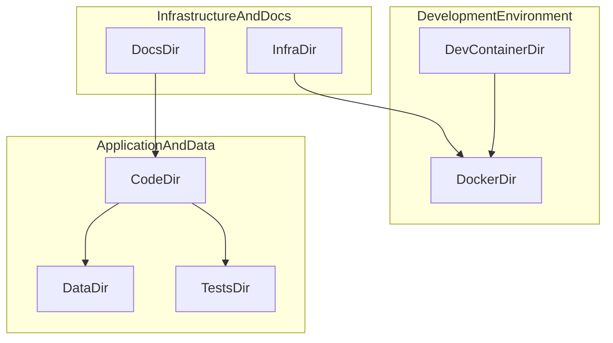

# Building a Hybrid AI Onboarding Pack Generator with Foundry Local and Microsoft Foundry

*How we used on-device and cloud LLMs to automatically generate engineering onboarding documentation for any GitHub repository and what we learned about local vs cloud model quality along the way.*

---

## The Problem: Onboarding Is Slow

Every engineering team knows the pain: a new developer joins, gets pointed at a repository, and spends days, sometimes weeks, piecing together how the codebase works. Where's the entry point? How do I build this? What should I work on first?

Documentation exists in theory. In practice, it's scattered across READMEs that haven't been updated, Confluence pages nobody maintains, and tribal knowledge locked in Slack or teams threads.

**What if an AI agent could analyze any repository and generate a complete onboarding pack in minutes?**

That's what we built.

## The Solution: Repo Onboarding Pack Generator

The [Repo Onboarding Pack Generator](https://github.com/leestott/learnskill-agent-foundrylocal) is an open-source tool that analyzes any GitHub repository and produces five files:

| File | What It Contains |
|------|-----------------|
| **ONBOARDING.md** | Architecture overview, component map, key flows, dependency inventory |
| **RUNBOOK.md** | Build, run, test, and deploy commands with troubleshooting |
| **TASKS.md** | 10 starter tasks for new contributors, ordered by difficulty |
| **VALIDATION.md** | Microsoft Learn validation queries for detected technologies |
| **diagram.mmd** | Mermaid component diagram showing system relationships |

It runs as a **CLI tool** or through a **web UI**, and supports two AI backends:

- **Foundry Local** — fully on-device inference, no data leaves your machine
- **Microsoft Foundry** — cloud-hosted models for higher quality output

## How It Works: A 10-Step Pipeline

The generator follows a structured pipeline, visible in real-time through the web UI's step tracker:

1. **Clone repository** — fetch from GitHub or use a local path
2. **Check AI provider** — connect to Foundry Local or Microsoft Foundry cloud
3. **Scan repository** — detect languages, dependencies, build systems, project structure
4. **Analyze key files** — LLM summarizes important source files (entry points, configs, READMEs)
5. **Generate architecture overview** — LLM produces the ONBOARDING.md content
6. **Generate starter tasks** — LLM creates 10 difficulty-graded tasks
7. **Generate component diagram** — LLM outputs a Mermaid diagram
8. **Compile onboarding pack** — assemble all sections into final documents
9. **Validate Microsoft technologies** — detect Azure, .NET, TypeScript etc. and generate Learn MCP queries
10. **Write output files** — save everything to disk

## The Web UI in Action

We built a browser-based interface that makes the tool accessible to anyone, no terminal required.

### Choosing Your AI Provider

The home screen lets you pick between Foundry Local (on-device) and Microsoft Foundry (cloud). The status panel shows real-time connection info, which model is loaded, the endpoint URL, and whether the service is online.

**Foundry Local — privacy-first, on-device inference:**


With Foundry Local, you get a dropdown of all cached models (18+ models available including Phi-4, Qwen 2.5, DeepSeek-R1, and Llama variants). Everything runs on your GPU — no API keys, no cloud, no data exfiltration risk.

**Microsoft Foundry — cloud-hosted, higher quality:**


Switch to cloud mode and the UI shows your Microsoft Foundry endpoint status, configured model (here, gpt-5.2), and API key status. Cloud settings are loaded from environment variables, no secrets in the UI.

### Generating Documentation

Fill in the form, paste a GitHub URL, pick your model, set an output directory, and hit Generate:


### Real-Time Progress Tracking

The step tracker shows exactly what's happening at each stage, with per-step details like "Found 6 languages, 0 deps — primary: Python" and file-by-file analysis progress:


Each step transitions through pending → running (with spinner) → completed (green checkmark), giving you full visibility into the pipeline:


### Generation Complete

When all 10 steps finish, you get a success summary and can preview or download each generated file directly from the browser:


## Testing Against a Real Repository

We tested the tool against [Azure-Samples/chat-with-your-data-solution-accelerator](https://github.com/Azure-Samples/chat-with-your-data-solution-accelerator) — a popular RAG pattern accelerator with **1,200+ stars**, **620+ forks**, and **34 contributors**. It's a non-trivial monorepo with a Python backend, TypeScript frontend, Azure Functions for batch processing, Bicep infrastructure-as-code, Docker support, and comprehensive test suites.


This is exactly the kind of repo where a new engineer would struggle to get oriented quickly.

## Local vs Cloud: A Quality Comparison

We ran the generator twice against the same repository, once with **Foundry Local** (qwen2.5-1.5b, on-device) and once with **Microsoft Foundry** (gpt-5.2, cloud).

### Output Size Comparison

| File | Local (qwen2.5-1.5b) | Cloud (gpt-5.2) |
|------|----------------------|-----------------|
| ONBOARDING.md | 5,510 bytes | 5,579 bytes |
| RUNBOOK.md | 2,358 bytes | 2,358 bytes |
| TASKS.md | 2,856 bytes | **8,133 bytes** |
| VALIDATION.md | 2,549 bytes | 2,549 bytes |
| diagram.mmd | 1,957 bytes | 838 bytes |

### Where Quality Diverged

The biggest difference was in **TASKS.md** — the starter tasks for new contributors.

**Local model (qwen2.5-1.5b)** produced generic, templated tasks:

> *"🟢 Task 1: Review README and documentation"*
> *"🟢 Task 5: Fix a typo or improve documentation"*
> *"🔴 Task 9: Refactor a complex function"*

These are fine as a starting framework, but they could apply to any repository.

**Cloud model (gpt-5.2)** produced repo-specific, actionable tasks with file-level precision:

> *"🟢 Task 1: Fix broken links and tighten README navigation"*
> Run the link checker workflow locally and fix broken/redirecting links in `README.md` and `docs/`
>
> *"🟢 Task 2: Add a small backend unit test for chat history API"*
> Create a focused unit test for `code/backend/api/chat_history.py` covering happy-path and error-path
>
> *"🔴 Task 8: Refactor Backend App Creation to Reduce Import Side Effects"*
> Audit `code/app.py` and `code/create_app.py` for import-time side effects...

Each cloud task included **acceptance criteria**, **time estimates**, **implementation hints**, and **exact file paths**. A new contributor could pick up Task 2 and start coding immediately.

### The Architecture Section

The cloud model's ONBOARDING.md included a detailed component table:

| Component | Directory | Purpose |
|-----------|-----------|---------|
| Dev container setup | `.devcontainer/` | Reproducible development environment |
| Application code | `code/` | Backend, frontend, and tests |
| Infrastructure as code | `infra/` | Azure provisioning (Bicep), prompt-flow |
| Test suites | `tests/` | E2E harness, Cypress UI tests, LLM evaluator |

It also described key interactions:
- Frontend API client communicates with Python backend via `code/backend/api/chat_history.py`
- Azure Functions batch processor in `code/backend/batch/` handles data ingestion
- Bicep modules in `infra/` provision the Azure resources

The local model described the same monorepo pattern but with less specificity.

### The Diagram

**Cloud model** — clean, grouped Mermaid diagram with logical subgraphs:



**Local model** — flat graph with many duplicate edges, less structured but still usable.

### The Takeaway

| Aspect | Foundry Local | Microsoft Foundry |
|--------|--------------|-------------------|
| **Privacy** | ✅ No data leaves machine | ❌ Data sent to cloud |
| **Cost** | ✅ Free after GPU investment | 💰 Pay-per-token |
| **Speed** | ⚡ Depends on local GPU | ⚡⚡ Fast cloud inference |
| **Task quality** | Generic templates | Repo-specific, actionable |
| **Architecture depth** | High-level overview | Component-level detail |
| **Setup** | `winget install Microsoft.FoundryLocal` | Azure account + API key |

**Use Foundry Local** when working with proprietary codebases where data cannot leave the machine, or for quick drafts that you'll refine manually.

**Use Microsoft Foundry** when output quality matters — onboarding packs for open-source projects, team documentation, or generating contributor guides.

## Technical Implementation Highlights

### Hybrid AI Client

The `LocalModelClient` class abstracts both backends behind a single OpenAI-compatible interface:

```typescript
// Both backends use the same OpenAI SDK — just different endpoints
const client = new OpenAI({
  baseURL: isCloud
    ? `${cloudEndpoint}/openai/deployments/${cloudModel}`
    : `${localEndpoint}/v1`,
  apiKey: isCloud ? cloudApiKey : "foundry-local",
});
```

Foundry Local auto-discovers its dynamic port via `foundry service status`, while cloud endpoints come from environment variables or CLI flags.

### Step-by-Step Progress Tracking

The web UI uses Server-Sent Events (SSE) to stream progress from the 10-step pipeline. Each step reports its status (pending → running → completed) with human-readable detail messages:

```
Step 3: Scanning repository...
  → Found 6 languages, 0 deps — primary: Python
Step 4: Analyzing key files...
  → Summarizing file 3/6: code/app.py
```

### Microsoft Learn Integration

When the scanner detects Microsoft technologies (TypeScript, Bicep, Azure SDKs, .NET), the generator produces a VALIDATION.md file with [Microsoft Learn MCP Server](https://github.com/MicrosoftDocs/mcp) queries:

```
microsoft_docs_search(query="Bicep overview Azure resource deployment")
microsoft_docs_search(query="TypeScript configuration tsconfig")
```

These let teams verify the generated documentation against official Microsoft sources.

## Build Something Like This

This project demonstrates several patterns you can reuse:

1. **Hybrid local/cloud AI** — Use Foundry Local for privacy, cloud for quality, same codebase for both
2. **Structured multi-step pipelines** — Break complex AI tasks into discrete steps with progress tracking
3. **Repository analysis** — Scan codebases for languages, dependencies, patterns, and structure
4. **SSE-based progress streaming** — Keep users informed during long-running AI workflows
5. **Agent Skills** — Package AI behaviors as reusable skills that Copilot agents can invoke

### Getting Started

```bash
# Clone the project
git clone https://github.com/leestott/learnskill-agent-foundrylocal
cd learnskill-agent-foundrylocal

# Install dependencies
npm install

# Run the web UI
npm run web
# Open http://localhost:3000

# Or use the CLI
npm run onboard -- https://github.com/Azure-Samples/chat-with-your-data-solution-accelerator
```

### Prerequisites

- **Node.js 20+**
- **Foundry Local** — `winget install Microsoft.FoundryLocal` (for on-device inference)
- **Microsoft Foundry account** — [foundry.microsoft.com](https://foundry.microsoft.com/) (for cloud inference)

### Try It on Your Own Repos

The best way to evaluate the tool is to run it against a repository you know well. You'll immediately see where the AI gets it right and where it needs refinement — and you can compare local vs cloud quality for your specific codebase.

```bash
# Your repo, local model
npm run onboard -- https://github.com/your-org/your-repo --model phi-4

# Your repo, cloud model
npm run onboard -- https://github.com/your-org/your-repo \
  --cloud-endpoint $FOUNDRY_CLOUD_ENDPOINT \
  --cloud-api-key $FOUNDRY_CLOUD_API_KEY \
  --cloud-model gpt-4o-mini
```

---

*The Repo Onboarding Pack Generator is open-source under the MIT License. Contributions welcome — check [TASKS.md](docs/demos/docswebcloud/TASKS.md) for example starter issues.*

*Built with [Foundry Local](https://github.com/microsoft/foundry), [Microsoft Foundry](https://foundry.microsoft.com/), the [OpenAI SDK](https://github.com/openai/openai-node), and the [Microsoft Learn MCP Server](https://github.com/MicrosoftDocs/mcp).*
