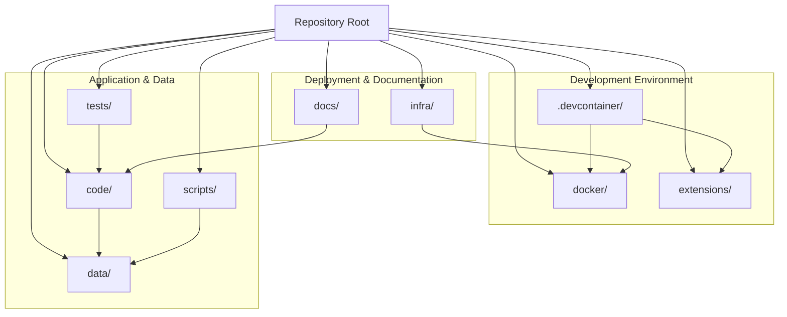

# Azure-Samples-chat-with-your-data-solution-accelerator - Onboarding Guide

## Overview

Azure-Samples-chat-with-your-data-solution-accelerator is a Python project with 0 dependencies. Languages used: Python (66%), TypeScript (17%), Bicep (13%). Test frameworks: pytest.

## Getting Started

Run `npm install` to install dependencies, then `npm run dev` or `npm start` to run the project.

## Architecture

### Pattern: Monorepo
This project is a single repository that contains multiple deployable parts: a Python backend (including an Azure Functions batch/ingestion workload and an admin UI), a separate TypeScript/Vite frontend web app, and an optional Microsoft Teams extension. Infrastructure-as-code (Azure Bicep) and deployment automation (Makefile, scripts, Docker assets, GitHub Actions) live alongside the application code, enabling end-to-end provisioning and CI/testing from one place.

The `code/` area is the core application: a backend that exposes chat/history capabilities and batch processing for ingestion/embedding, plus a standalone frontend that calls backend APIs. The repo also includes sample documents under `data/` to exercise ingestion and RAG flows, and multiple test suites (Python unit/functional, Cypress UI, and an LLM evaluator) to validate behavior across components.

**Key interactions**
1. `code/frontend/src/api/*` calls into the Python backend entrypoints (`code/app.py`, `code/create_app.py`) to drive the chat experience and related operations.
2. `code/backend/batch/function_app.py` and related batch scripts process/ingest content (e.g., embedding/indexing workflows) and integrate with the rest of the backend used by the chat app.
3. `infra/` (Bicep) provisions the Azure resources required by the backend/function workloads and is driven by automation in `Makefile` and `scripts/` (and supported by CI workflows in `.github/workflows/`).

### Components
| Component | Directory | Purpose |
|-----------|-----------|---------|
| Dev container setup | `.devcontainer/` | Reproducible local development environment (Dockerfile/devcontainer config and setup script). |
| GitHub automation | `.github/` | Issue templates and CI/CD workflows (including Bicep auditing and link checking). |
| Application code | `code/` | Main solution code: Python backend (API, batch/Azure Functions, admin UI) and the TypeScript frontend, plus Python tests and app entrypoints. |
| Sample content | `data/` | Example documents (PDF/DOCX) used for ingestion and demo scenarios. |
| Containerization | `docker/` | Dockerfiles and docker-compose configuration for running components locally/packaged. |
| Documentation | `docs/` | Architecture/design notes (ADRs), guides, images, and spikes (including a notebook). |
| Teams extension | `extensions/` | Microsoft Teams app/bot package, configuration, and its own infra/scripts. |
| Infrastructure as code | `infra/` | Azure Bicep modules and prompt-flow deployment assets for provisioning the solution. |
| Utility scripts | `scripts/` | Helper scripts for quota checks, packaging, env parsing, and data setup (e.g., Postgres tables). |
| Additional test suites | `tests/` | End-to-end tests, Cypress UI integration tests, and an LLM evaluation harness. |

## Key Flows

### Build

Build the project using npm

**Steps:**
1. Install dependencies
2. Run build script
3. Output to dist/build folder

**Files:** `package.json`

## Component Diagram

## For Instructors

This section summarises the project for instructors, supervisors, and mentors overseeing student onboarding.

### Project Complexity

- **Dependency count:** 0
- **Key flows:** 1
- **Estimated complexity:** Low

### Learning Outcomes

Students working through the onboarding tasks will learn to:

1. Navigate and understand an unfamiliar codebase
2. Set up and run a real-world development environment
3. Read and write automated tests
4. Contribute code through the pull request workflow
5. Use GitHub Copilot as a learning and productivity tool

### Suggested Session Plan

| Session | Focus | Tasks |
|---------|-------|-------|
| 1 | Orientation & setup | Tasks 1-3 (easy) |
| 2 | First contribution | Tasks 4-5 (easy-medium) |
| 3 | Deeper work | Tasks 6-8 (medium) |
| 4 | Independent feature | Tasks 9-10 (hard) |

## Microsoft Technology References

The following Microsoft technologies were detected in this repository. Use the [Microsoft Learn MCP Server](https://learn.microsoft.com/api/mcp) to verify details and find up-to-date documentation.

| Technology | Category | Confidence | Evidence |
|------------|----------|------------|----------|
| TypeScript | typescript | high | TypeScript source files detected |
| Bicep | azure-service | high | Found .bicep files |

### Validation Queries

Run these queries with the Microsoft Learn MCP tools to verify and deepen understanding:

#### TypeScript

- `microsoft_docs_search(query="TypeScript configuration tsconfig")` — Verify TypeScript setup
- `microsoft_docs_search(query="TypeScript best practices")` — Review best practices

#### Bicep

- `microsoft_docs_search(query="Bicep overview Azure resource deployment")` — Understand infrastructure as code
- `microsoft_docs_search(query="Bicep best practices modules")` — Review deployment best practices

