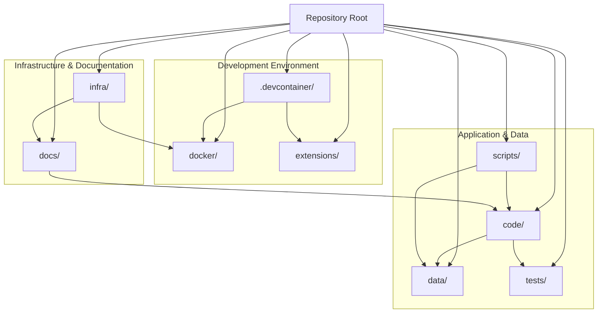

# Azure-Samples-chat-with-your-data-solution-accelerator - Onboarding Guide

## Overview

Azure-Samples-chat-with-your-data-solution-accelerator is a Python project with 0 dependencies. Languages used: Python (66%), TypeScript (17%), Bicep (13%). Test frameworks: pytest.

## Getting Started

Run `npm install` to install dependencies, then `npm run dev` or `npm start` to run the project.

## Architecture

### Pattern: Monorepo
This repository is a single source tree that contains multiple deployable parts of an end-to-end “chat with your data” solution: a Python backend, a separate web frontend, an admin UI, and an Azure Functions-based batch/ingestion subsystem. It also includes infrastructure-as-code for Azure provisioning (Bicep), containerization assets (Dockerfiles and compose), and multiple layers of automated testing (unit/functional/e2e/UI), all coordinated via the root `Makefile` and GitHub Actions workflows.

The runtime architecture is a web application where the **frontend** (in `code/frontend/`) calls into the **backend** (in `code/backend/`) for conversational/RAG operations and related APIs (e.g., chat history). Data ingestion and processing is supported by a **batch/functions** area (`code/backend/batch/`) that is structured like an Azure Functions app (`function_app.py`, `host.json`) and includes scripts for embedding and processing content. Deployment is driven by `infra/` (Bicep modules and prompt-flow assets) and can be run locally via `docker/` and developer tooling in `.devcontainer/` and `scripts/`.

### Components
| Component | Directory | Purpose |
|-----------|-----------|---------|
| Dev container setup | `.devcontainer/` | Reproducible development environment (Dockerfile + setup scripts). |
| GitHub automation | `.github/` | CI/CD workflows and repo governance templates/config. |
| Application code | `code/` | Main product code: backend, frontend, and in-repo tests plus app entrypoints (`app.py`, `create_app.py`). |
| Sample/source documents | `data/` | Example PDFs/docs used for ingestion and testing the solution. |
| Containerization | `docker/` | Dockerfiles and `docker-compose.yml` for running components locally/packaging images. |
| Documentation | `docs/` | Architecture/design docs, ADRs, guides, and images; includes a notebook spike. |
| Teams extension | `extensions/` | Microsoft Teams app/bot package, config, and infra for Teams integration. |
| Infrastructure as code | `infra/` | Azure provisioning templates (Bicep), prompt-flow deployment assets, and workbooks. |
| Utility scripts | `scripts/` | Helper scripts for env parsing, quota checks, packaging, and DB/table setup. |
| Test suites | `tests/` | Higher-level tests: e2e test harness, Cypress UI integration tests, and an LLM evaluator tool. |

**Key interactions**
1. `code/frontend/src/api/` communicates with the Python app in `code/` (entrypoints `app.py` / `create_app.py`) to run chat/RAG flows and retrieve/store chat history (evidenced by `code/backend/api/chat_history.py` and frontend API client code).
2. `code/backend/batch/` (Azure Functions-style app) performs ingestion/processing tasks (e.g., `add_url_embeddings.py`, `batch_start_processing.py`) that prepare data used by the backend’s conversational responses.
3. `infra/` provisions the Azure resources and deployment configuration that the runtime components depend on, while `docker/` and `scripts/` support local runs and packaging; `tests/` exercises the deployed/local system via functional/e2e/UI test layers.

## Key Flows

### Build

Build the project using npm

**Steps:**
1. Install dependencies
2. Run build script
3. Output to dist/build folder

**Files:** `package.json`

## Component Diagram

## Microsoft Technology References

The following Microsoft technologies were detected in this repository. Use the [Microsoft Learn MCP Server](https://learn.microsoft.com/api/mcp) to verify details and find up-to-date documentation.

| Technology | Category | Confidence | Evidence |
|------------|----------|------------|----------|
| TypeScript | typescript | high | TypeScript source files detected |
| Bicep | azure-service | high | Found .bicep files |

### Validation Queries

Run these queries with the Microsoft Learn MCP tools to verify and deepen understanding:

#### TypeScript

- `microsoft_docs_search(query="TypeScript configuration tsconfig")` — Verify TypeScript setup
- `microsoft_docs_search(query="TypeScript best practices")` — Review best practices

#### Bicep

- `microsoft_docs_search(query="Bicep overview Azure resource deployment")` — Understand infrastructure as code
- `microsoft_docs_search(query="Bicep best practices modules")` — Review deployment best practices

