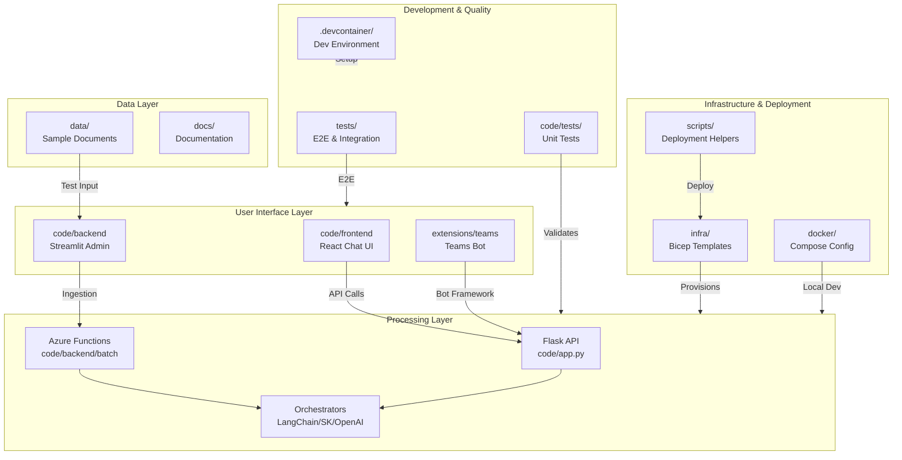

# Azure-Samples-chat-with-your-data-solution-accelerator - Onboarding Guide

## Overview

Azure-Samples-chat-with-your-data-solution-accelerator is a Python project with 0 dependencies. Languages used: Python (66%), TypeScript (17%), Bicep (13%). Test frameworks: pytest.

## Getting Started

Run `npm install` to install dependencies, then `npm run dev` or `npm start` to run the project.

## Architecture

### Pattern: Serverless

This is an Azure-native RAG (Retrieval Augmented Generation) solution accelerator using a serverless architecture. The system enables conversational search over user documents by combining Azure OpenAI for LLM capabilities with Azure AI Search for vector retrieval. It features a multi-tier design with separate frontend chat UI, admin management interface (Streamlit), and Azure Functions for asynchronous document processing and ingestion.

The deployment model uses Azure Developer CLI (`azd`) with Bicep infrastructure-as-code, allowing one-command provisioning of all Azure resources. The codebase supports multiple orchestration strategies (LangChain, Semantic Kernel, OpenAI Functions, Prompt Flow) and dual database options (Cosmos DB or PostgreSQL with pgvector). Local development is supported via Docker Compose, and CI/CD is handled through comprehensive GitHub Actions workflows.

The architecture separates concerns between user-facing chat (React/Vite frontend), administrative data management (Streamlit backend), and event-driven document processing (Azure Functions triggered by blob storage events). This enables independent scaling and deployment of each component while sharing common utilities and Azure service integrations.

### Components

| Component | Directory | Purpose |
|-----------|-----------|---------|
| Application Code | `code/` | Main source: Flask/Streamlit backend, React frontend, Azure Functions batch processing, shared utilities |
| Frontend | `code/frontend/` | React/TypeScript chat UI built with Vite, includes speech-to-text support |
| Backend Admin | `code/backend/` | Streamlit admin app for data ingestion, exploration, deletion, and configuration |
| Batch Processing | `code/backend/batch/` | Azure Functions for async document processing, embedding generation, URL indexing |
| Unit/Functional Tests | `code/tests/` | Python pytest suite covering utilities, orchestrators, search handlers, chat history |
| Infrastructure | `infra/` | Bicep templates for Azure resources: App Services, Functions, Cognitive Services, Storage, KeyVault, networking |
| Docker | `docker/` | Dockerfiles and compose config for local development of frontend, admin, and backend |
| Extensions | `extensions/teams/` | Microsoft Teams bot integration with Bot Framework and adaptive cards |
| Scripts | `scripts/` | Deployment helpers: auth disable, frontend packaging, PostgreSQL table creation, quota checks |
| E2E/Integration Tests | `tests/` | Playwright-based e2e tests, Cypress UI tests, LLM evaluation framework |
| Sample Data | `data/` | PDF/DOCX documents (contracts, employee handbooks) for testing ingestion and chat |
| Documentation | `docs/` | Setup guides, architecture diagrams, ADRs, and feature documentation |
| CI/CD | `.github/workflows/` | GitHub Actions for testing, Docker builds, Bicep validation, releases, Dependabot |
| Dev Container | `.devcontainer/` | VS Code dev container configuration for consistent development environment |

## Key Flows

### Build

Build the project using npm

**Steps:**
1. Install dependencies
2. Run build script
3. Output to dist/build folder

**Files:** `package.json`

## Component Diagram

## For Instructors

This section summarises the project for instructors, supervisors, and mentors overseeing student onboarding.

### Project Complexity

- **Dependency count:** 0
- **Key flows:** 1
- **Estimated complexity:** Low

### Learning Outcomes

Students working through the onboarding tasks will learn to:

1. Navigate and understand an unfamiliar codebase
2. Set up and run a real-world development environment
3. Read and write automated tests
4. Contribute code through the pull request workflow
5. Use GitHub Copilot as a learning and productivity tool

### Suggested Session Plan

| Session | Focus | Tasks |
|---------|-------|-------|
| 1 | Orientation & setup | Tasks 1-3 (easy) |
| 2 | First contribution | Tasks 4-5 (easy-medium) |
| 3 | Deeper work | Tasks 6-8 (medium) |
| 4 | Independent feature | Tasks 9-10 (hard) |

## Microsoft Technology References

The following Microsoft technologies were detected in this repository. Use the [Microsoft Learn MCP Server](https://learn.microsoft.com/api/mcp) to verify details and find up-to-date documentation.

| Technology | Category | Confidence | Evidence |
|------------|----------|------------|----------|
| TypeScript | typescript | high | TypeScript source files detected |
| Bicep | azure-service | high | Found .bicep files |

### Validation Queries

Run these queries with the Microsoft Learn MCP tools to verify and deepen understanding:

#### TypeScript

- `microsoft_docs_search(query="TypeScript configuration tsconfig")` — Verify TypeScript setup
- `microsoft_docs_search(query="TypeScript best practices")` — Review best practices

#### Bicep

- `microsoft_docs_search(query="Bicep overview Azure resource deployment")` — Understand infrastructure as code
- `microsoft_docs_search(query="Bicep best practices modules")` — Review deployment best practices

