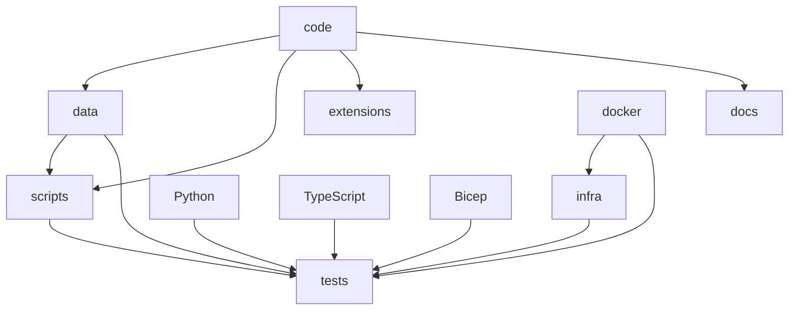

# Azure-Samples-chat-with-your-data-solution-accelerator - Onboarding Guide

## Overview

Azure-Samples-chat-with-your-data-solution-accelerator is a Python project with 0 dependencies. Languages used: Python (66%), TypeScript (17%), Bicep (13%). Test frameworks: pytest.

## Getting Started

Run `npm install` to install dependencies, then `npm run dev` or `npm start` to run the project.

## Architecture

### Pattern: Monolithic

The project is structured as a monolithic application, where all components are tightly coupled and reside in a single codebase. The main components include:

#### Components
- **Backend**: Contains the backend services such as API endpoints, database operations, and orchestration logic.
- **Frontend**: Manages the user interface and interacts with the backend through APIs.
- **Data**: Stores and manages the contract data, including PDFs and other relevant information.
- **Docker**: Handles the deployment of backend services using Docker containers.
- **Documentation**: Provides detailed documentation on how to use the solution accelerator.

#### Key Interactions
- **Backend** communicates with the **Database** to store and retrieve contract data.
- **Frontend** sends requests to the **Backend** to perform operations like adding URLs, configuring platforms, and managing users.
- **Data** is accessed by both the **Backend** and **Frontend** to ensure consistency and integrity of the data.

This monolithic approach simplifies development and deployment but may lead to increased coupling and difficulty in scaling individual components independently.

## Key Flows

### Build

Build the project using npm

**Steps:**
1. Install dependencies
2. Run build script
3. Output to dist/build folder

**Files:** `package.json`

## Component Diagram

## For Instructors

This section summarises the project for instructors, supervisors, and mentors overseeing student onboarding.

### Project Complexity

- **Dependency count:** 0
- **Key flows:** 1
- **Estimated complexity:** Low

### Learning Outcomes

Students working through the onboarding tasks will learn to:

1. Navigate and understand an unfamiliar codebase
2. Set up and run a real-world development environment
3. Read and write automated tests
4. Contribute code through the pull request workflow
5. Use GitHub Copilot as a learning and productivity tool

### Suggested Session Plan

| Session | Focus | Tasks |
|---------|-------|-------|
| 1 | Orientation & setup | Tasks 1-3 (easy) |
| 2 | First contribution | Tasks 4-5 (easy-medium) |
| 3 | Deeper work | Tasks 6-8 (medium) |
| 4 | Independent feature | Tasks 9-10 (hard) |

## Microsoft Technology References

The following Microsoft technologies were detected in this repository. Use the [Microsoft Learn MCP Server](https://learn.microsoft.com/api/mcp) to verify details and find up-to-date documentation.

| Technology | Category | Confidence | Evidence |
|------------|----------|------------|----------|
| TypeScript | typescript | high | TypeScript source files detected |
| Bicep | azure-service | high | Found .bicep files |

### Validation Queries

Run these queries with the Microsoft Learn MCP tools to verify and deepen understanding:

#### TypeScript

- `microsoft_docs_search(query="TypeScript configuration tsconfig")` — Verify TypeScript setup
- `microsoft_docs_search(query="TypeScript best practices")` — Review best practices

#### Bicep

- `microsoft_docs_search(query="Bicep overview Azure resource deployment")` — Understand infrastructure as code
- `microsoft_docs_search(query="Bicep best practices modules")` — Review deployment best practices

