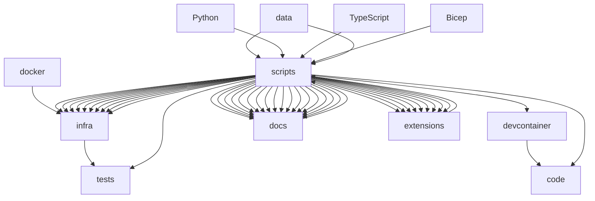

# Azure-Samples-chat-with-your-data-solution-accelerator - Onboarding Guide

## Overview

Azure-Samples-chat-with-your-data-solution-accelerator is a Python project with 0 dependencies. Languages used: Python (66%), TypeScript (17%), Bicep (13%). Test frameworks: pytest.

## Getting Started

Run `npm install` to install dependencies, then `npm run dev` or `npm start` to run the project.

## Architecture

### Pattern: Monorepo

The project follows a monorepo architecture where multiple components share a single root directory. This allows for easier collaboration and sharing of code among different parts of the application. 

#### Components
- **Root Directory**: Contains all the components and their respective directories. 
- **Backend**: Handles business logic and API endpoints. 
- **Frontend**: Provides the interface for users to interact with the application. 
- **Docker**: Manages the deployment of the application on different platforms. 
- **Documentation**: Includes documentation and guides for developers. 
- **Extensions**: Various extensions and integrations for different use cases. 
- **Infrastructure**: Configures infrastructure settings and manages cloud resources. 
- **Scripts**: Contains shell scripts for automation and testing. 
- **Tests**: Contains unit and integration tests for the application. 

#### Key Interactions
- **API Endpoints**: The backend provides RESTful APIs for interacting with the frontend and other external services.
- **UI Integration**: The frontend interacts with the backend through APIs to fetch data and display it.
- **CI/CD**: Continuous Integration and Continuous Deployment pipelines ensure that new changes are tested and deployed automatically.
- **Documentation**: Documentation is stored separately but referenced by the frontend and backend.
- **Extensions**: Extensions can integrate with the existing components to provide additional functionality.
- **Infrastructure**: Infrastructure configurations are managed centrally to ensure consistency across different environments.
- **Testing**: Unit and integration tests are executed to ensure the quality and reliability of the application.

This monorepo approach simplifies the development process by consolidating all components under a single namespace, making it easier to maintain and update the overall system.

## Key Flows

### Build

Build the project using npm

**Steps:**
1. Install dependencies
2. Run build script
3. Output to dist/build folder

**Files:** `package.json`

## Component Diagram

## Microsoft Technology References

The following Microsoft technologies were detected in this repository. Use the [Microsoft Learn MCP Server](https://learn.microsoft.com/api/mcp) to verify details and find up-to-date documentation.

| Technology | Category | Confidence | Evidence |
|------------|----------|------------|----------|
| TypeScript | typescript | high | TypeScript source files detected |
| Bicep | azure-service | high | Found .bicep files |

### Validation Queries

Run these queries with the Microsoft Learn MCP tools to verify and deepen understanding:

#### TypeScript

- `microsoft_docs_search(query="TypeScript configuration tsconfig")` — Verify TypeScript setup
- `microsoft_docs_search(query="TypeScript best practices")` — Review best practices

#### Bicep

- `microsoft_docs_search(query="Bicep overview Azure resource deployment")` — Understand infrastructure as code
- `microsoft_docs_search(query="Bicep best practices modules")` — Review deployment best practices

