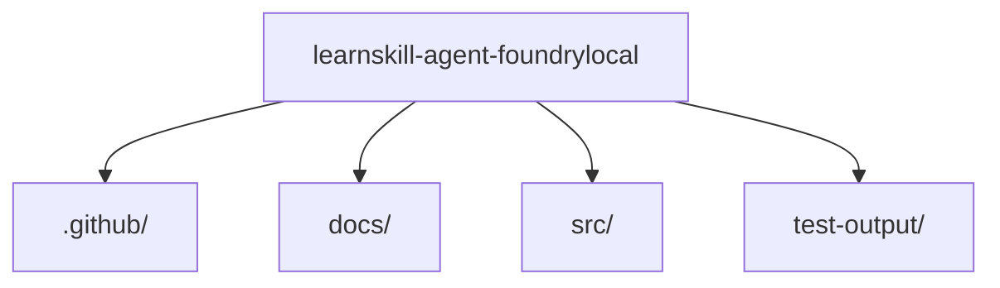

# learnskill-agent-foundrylocal - Onboarding Guide

## Overview

learnskill-agent-foundrylocal is a TypeScript project with 9 dependencies. Languages used: TypeScript (82%), PowerShell (9%), Shell (9%). Test frameworks: None detected.

## Getting Started

Run `npm install` to install dependencies, then `npm run dev` or `npm start` to run the project.

## Architecture

This TypeScript, PowerShell, Shell project has a standard structure with 4 main directories: .github, docs, src, test-output. The project uses npm for build management.

## Key Flows

### Build

Build the project using npm

**Steps:**
1. Install dependencies
2. Run build script
3. Output to dist/build folder

**Files:** `package.json`

### Application Startup

Main entry point and initialization

**Steps:**
1. Load configuration
2. Initialize dependencies
3. Start main process

**Files:** `dist/index.js`, `./dist/index.js`, `src/index.ts`

## Component Diagram

## Key Dependencies

| Package | Purpose | Version |
|---------|---------|--------|
| @github/copilot-sdk | npm production dependency | ^0.1.23 |
| commander | npm production dependency | ^12.1.0 |
| dotenv | npm production dependency | ^17.2.4 |
| glob | npm production dependency | ^11.0.0 |
| ignore | npm production dependency | ^6.0.2 |
| openai | npm production dependency | ^4.70.0 |
| @types/node | npm development dependency | ^22.9.0 |
| tsx | npm development dependency | ^4.19.2 |
| typescript | npm development dependency | ^5.6.3 |

## Microsoft Technology References

The following Microsoft technologies were detected in this repository. Use the [Microsoft Learn MCP Server](https://learn.microsoft.com/api/mcp) to verify details and find up-to-date documentation.

| Technology | Category | Confidence | Evidence |
|------------|----------|------------|----------|
| TypeScript | typescript | high | TypeScript source files detected |

### Validation Queries

Run these queries with the Microsoft Learn MCP tools to verify and deepen understanding:

#### TypeScript

- `microsoft_docs_search(query="TypeScript configuration tsconfig")` — Verify TypeScript setup
- `microsoft_docs_search(query="TypeScript best practices")` — Review best practices

